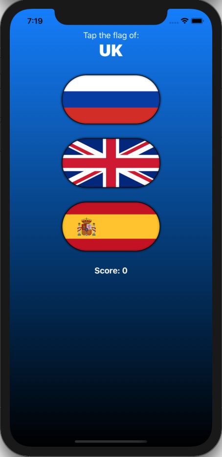
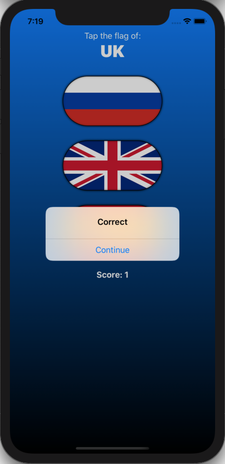
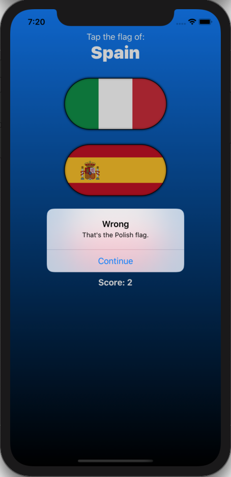

# 100 Days of SwiftUI Project 3

## Guess the Flag App

**App Description:**  Simple app to guess a country's flag, from a choice of 3 flags.

**Swift Features Used:**
View constructs such as LinearGradient, Button, Alert, ZStack, VStack, @State property wrapper, renderingMode, clipShape, overlay, shadow.

**Screenshots:**

